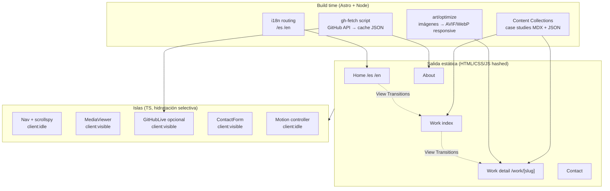
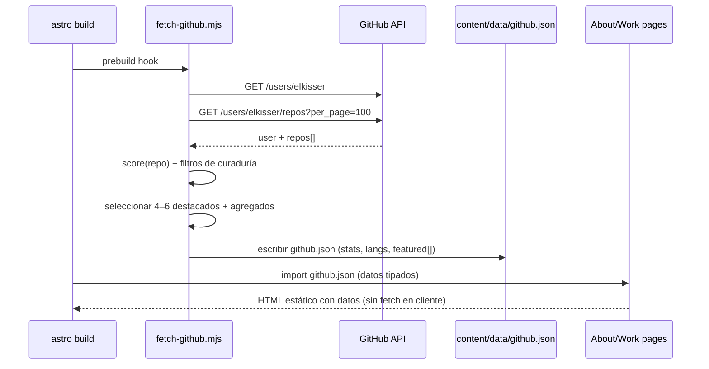
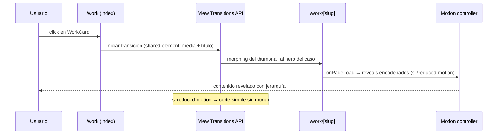
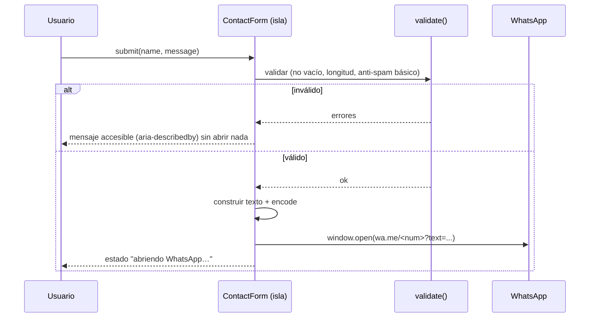

# Documento de Diseño: portfolio-redesign

> Transformación completa del portfolio de Sebastián Kisser, de sitio estático
> vanilla a un producto editorial premium construido con **Astro + islas (TypeScript)**.
> Objetivo: calidad de producto que pueda competir visualmente en Awwwards / CSS Design
> Awards, con identidad propia, intención en cada sección y rendimiento extremo.
>
> **Este documento es una propuesta para aprobar antes de implementar.** Reúne el
> análisis del proyecto actual (Fase 1), la estrategia de análisis de GitHub (Fase 2),
> los principios extraídos de los referentes (Fase 3), la dirección de arte y el diseño
> técnico high-level + low-level.

---

## Overview
### (Resumen ejecutivo)

El portfolio actual ya tiene una base estética sólida (dark editorial, acento ámbar,
escala de 8pt, buena tipografía, cursor custom, grano, marquee). No es un sitio "feo":
es un sitio **correcto pero genérico** en su estructura. Cae en varios de los patrones
que el brief pide evitar: hero clásico de título gigante + dos botones, grilla de
proyectos 2×N con tarjetas casi idénticas, sección de stack en listas, "stat cards" de
GitHub, glow radial en el hero y cover con gradiente radial — exactamente las señales
que leen como "plantilla".

La transformación no es un restyle: es **re-pensar la experiencia** alrededor de una
sola idea fuerte (la *art direction*), convertir los proyectos en **case studies reales**
(problema → decisión técnica → resultado), integrar GitHub como **evidencia viva** y no
como contador, y migrar a una arquitectura **Astro + content collections** que permite
rendimiento casi perfecto y escala editorial.

> **Nota metodológica (a pedido del usuario):** la elección de framework **no es una
> conclusión anticipada**. Se evaluó formalmente frente a alternativas reales en
> [ADR 0001](../../../docs/decisions/0001-framework-choice.md) y la plataforma de deploy en
> [ADR 0002](../../../docs/decisions/0002-deploy-platform.md). Astro gana **por evidencia**
> para este caso (sitio de contenido, mayormente estático, SEO/i18n críticos, CWV como
> prioridad). Si durante el desarrollo aparece una decisión mejor fundamentada, se propone y
> justifica el cambio: la calidad final es la prioridad absoluta, aun si implica rehacer partes.

Decisiones de arquitectura clave (justificadas en §6 y en los ADR):

| Decisión | Elección | Por qué |
|---|---|---|
| Framework | Astro 7 (Vite 8) + islas | Cero JS por defecto, JS solo donde aporta; mejor techo de CWV (ver ADR 0001) |
| Contenido | Content Collections + MDX | Case studies como datos tipados, no HTML hardcodeado |
| Interactividad | Islas vanilla TS / Web Components | Cero runtime de framework salvo donde sea imprescindible |
| Transiciones | View Transitions API nativa de Astro | Navegación tipo SPA sin coste de SPA |
| Animación | CSS-first + scroll-driven animations + GSAP solo si una isla lo justifica | Elegancia sobre espectáculo, respeta `reduced-motion` |
| GitHub | Build-time fetch + cache + revalidación cliente opcional | Datos sin parpadeo, sin rate-limit en cada visita |
| i18n | `astro:i18n` con routing `/es` `/en` | Reemplaza el swap por JS; URLs indexables por idioma |

---

## 1. FASE 1 — Análisis del proyecto actual (hallazgos)

Auditoría realizada leyendo `index.html`, `styles/style.css`, y `js/{main,carousel,github,i18n}.js`.

### 1.1 Arquitectura y código

**Estado:** Sitio estático de un solo archivo `index.html` (~586 líneas) + 1 hoja de
estilo (~1592 líneas) + 4 scripts IIFE sin bundler ni dependencias.

| Hallazgo | Severidad | Detalle |
|---|---|---|
| Todo el contenido vive en HTML hardcodeado | Alta | Proyectos, experiencia y textos están incrustados; añadir un case study obliga a editar markup + duplicar i18n en `i18n.js`. No escala. |
| i18n por reemplazo de `textContent` | Alta | `i18n.js` sustituye texto en runtime. Hay **un solo idioma indexable** (SEO pierde la versión EN); FOUC de idioma; el `<title>`/meta no se traducen. |
| Sin sistema de build | Media | No hay minificación, tree-shaking, hashing de assets ni split. Acentúa el coste de mantener todo a mano. |
| README desincronizado con el código | Media | El README describe `script.js`, `translations.js`, `autotype.js`, `videos.js`, paleta `#ffe600`/Poppins — **nada de eso existe ya**. Documentación muerta. |
| Código muerto / no usado | Media | Hay videos en `img/*` (Chromora, LuminaEdit, SoMoS, TheCookieBox, TheWorldIsBeautiful, YoNoFui) que **no se referencian** en el HTML. El carrusel siempre renderiza el cover de marca porque `data-shots=""` en todos los proyectos. |
| Acoplamiento por `data-*` y selectores globales | Baja | `main.js` cablea por clases globales; frágil ante cambios de markup. |

### 1.2 Estructura visual y sistema de diseño

**Lo que ya es bueno y hay que preservar (Chesterton's fence):**
- Tokens de diseño coherentes en `:root` (superficies, tinta, acento ámbar, escala 8pt, `--ease`).
- Tipografía con jerarquía real: Space Grotesk (display) / Inter (body) / JetBrains Mono (mono).
- Detalles de oficio: `::selection`, `:focus-visible`, skip-link, grano sutil, scroll progress.

**Lo que lee como "IA/plantilla" y hay que rediseñar:**
- **Hero**: título gigante en 3 líneas + eyebrow "Disponible" + 2 botones + glow radial ámbar (`.hero-glow`) → patrón visto en cientos de portfolios.
- **Proyectos**: grilla 2×N de tarjetas idénticas; los "covers" son gradiente radial + patrón diagonal repetido → genérico.
- **GitHub**: 4 *stat cards* con números → el anti-patrón "dashboard decorativo".
- **Stack**: 4 columnas de listas de texto plano.
- Filtros tipo "pills" estándar.

### 1.3 UX e información

| Hallazgo | Detalle |
|---|---|
| Navegación plana de 6 ítems | Work / About / Stack / GitHub / Experience / Contact. Stack y GitHub compiten por atención y diluyen el foco (los proyectos). |
| Proyectos sin profundidad | Cada proyecto es 1 párrafo + tags + links. No hay caso, no hay historia, no hay imágenes reales (solo cover). El centro del portfolio es lo más débil. |
| Sin página de detalle | Todo es one-page; no hay URL por proyecto (malo para compartir y para SEO). |
| Formulario → WhatsApp | Decisión válida y personal; se conserva, pero hoy no hay validación de longitud ni anti-spam y abre `wa.me` sin estado de feedback. |

### 1.4 Responsive

Breakpoints en 1024 / 860 / 560 / 1600px. Funciona, pero el salto principal (860px) colapsa
mucho de golpe; no hay un diseño pensado por breakpoint (laptop 1280, ultra-wide >1600 apenas
sube `--maxw`). El brief pide que **cada breakpoint se sienta diseñado**.

### 1.5 Accesibilidad (WCAG 2.1 AA)

| Item | Estado |
|---|---|
| Skip-link, `:focus-visible`, `aria-*` en nav/menú | ✅ Presente |
| `prefers-reduced-motion` | ✅ Respetado en CSS y en cada script |
| Contraste | ⚠️ A verificar: `--text-mute #8a8a90` sobre `--bg #0a0a0b` ≈ 4.6:1 (texto normal pasa por poco; cuidado en textos pequeños). El acento `#e8b75c` sobre fondo oscuro es correcto para texto grande/no-texto. |
| Cursor custom oculta el cursor nativo | ⚠️ `cursor: none` puede afectar a usuarios con baja visión; debe quedar 100% opcional y nunca romper foco/teclado. |
| Formulario | ⚠️ Labels flotantes dependen de `:placeholder-shown`; ok, pero falta `aria-describedby` para el error. |
| Idioma | ❌ Al traducir por JS, los lectores de pantalla no obtienen `lang` por bloque; la versión EN no es una página real. |

### 1.6 SEO

`robots.txt`, `sitemap.xml`, Open Graph, Twitter card, JSON-LD `Person` ya presentes — buena base.
Problemas: **una sola URL** (no hay `/en`, ni URLs por proyecto), `sitemap.xml` estático (se
desincroniza), meta/title no localizados, sin JSON-LD por proyecto (`CreativeWork`).

### 1.7 Performance

| Hallazgo | Impacto |
|---|---|
| Google Fonts vía `<link>` con 3 familias y múltiples pesos | Render-blocking + dependencia externa; mejor self-host + `font-display: swap` + subsetting. |
| Videos `.mp4/.webm` en `img/*` sin usar | Peso potencial; si se usan como preview, hay que hacer lazy + `poster` + formatos modernos. |
| `foto-perfil.png` | Debe ser AVIF/WebP responsivo. |
| Sin build | No hay hashing, minify ni critical CSS; el CSS de ~1.6k líneas se sirve completo. |
| GitHub fetch en cada visita (1h cache en sessionStorage) | Llama a la API pública en cliente; puede dar rate-limit (60 req/h/IP) y produce *count-up* tras carga (CLS de contenido). |

### 1.8 Animaciones

Reveal por IntersectionObserver, count-up, typing del rol, cursor con lerp, marquee, scroll
progress, pulse del status dot. **Todo razonable y con reduced-motion.** El typing del rol y el
glow del hero son los que más "saben a plantilla". La estrategia nueva mantiene la disciplina
(reduced-motion siempre) pero sube el nivel de intención (ver §10).

### 1.9 Branding

Identidad actual: monograma "SK", ámbar sobre negro, voz bilingüe, tono "criterio/oficio".
Es un buen punto de partida. La art direction (§4) lo lleva de "tema oscuro correcto" a
**sistema editorial con firma propia**.

---

## 2. FASE 2 — Estrategia de análisis de GitHub (case studies)

**Usuario detectado en el código:** `elkisser` (constante `USER` en `js/github.js` y
`sameAs` del JSON-LD → `https://github.com/elkisser`). ✅ No hace falta confirmarlo, pero
ver nota al final de la sección.

El brief pide analizar el GitHub para **detectar los mejores repos** y mostrarlos como
case studies — *solo lo mejor, no todo*. El análisis se hará en **build time** (script Node
que pega a la API pública con token opcional) y producirá un *informe de selección* + datos
para alimentar las content collections.

### 2.1 Señales de scoring por repositorio

```
score(repo) =
    w1 · norm(stars)
  + w2 · norm(forks)
  + w3 · recencia(pushed_at)        // actividad reciente pesa
  + w4 · tieneHomepage/demo         // producto terminado y desplegado
  + w5 · calidadREADME              // longitud + imágenes + secciones
  + w6 · complejidad(lenguajes,loc) // multi-lenguaje / tamaño
  + w7 · esFuente(!fork && !archived)
  − p1 · esFork
  − p2 · sinDescripción
  − p3 · abandonado(>18 meses)
```

### 2.2 Criterios de selección (curaduría, no volcado)

1. **Terminado y desplegado** (tiene demo/homepage) → prioridad máxima.
2. **Complejidad técnica real** (multi-stack, IA, realtime, etc.).
3. **Open source con README cuidado** (cuenta una historia).
4. **Diversidad de competencias** (full-stack, frontend, IA, e-commerce).
5. **Recencia** (mantenido en los últimos ~12-18 meses).

Mostrar **4–6 destacados** como case studies; el resto se resume o se enlaza al perfil.

### 2.3 Candidatos ya visibles en el código actual

Estos ya están en el sitio y son fuertes candidatos a case study (a confirmar con datos vivos):

| Proyecto | Repo | Señales | Categoría |
|---|---|---|---|
| Chromora | `elkisser/chromora` | Next 15, IA (NL→paleta), LCH/Chroma.js, Framer Motion | IA / Frontend |
| Prode | `elkisser/prode` | Realtime, Supabase, Sports APIs, desplegado | Full-stack |
| The Cookie Box | `elkisser/the-cookie-box` | E-commerce, admin seguro, WebP, desplegado | Full-stack |
| Yo No Fui | `elkisser/yo-no-fui` | Astro 5 + React 19, Zustand, OpenAI | IA / Frontend |
| LuminaEdit | `elkisser/LuminaEdit` | TensorFlow.js + WebGL, IA local | IA |
| SoMoS | `elkisser/SoMoS` | Astro + Framer Motion, sitio agencia | Frontend |

> **A confirmar (Doubt-Driven):** el scan en vivo puede revelar repos mejores aún no
> mostrados, o que alguno de estos esté menos pulido de lo que parece. La selección final
> sale del informe de build, no de esta tabla. Si querés que prioricemos repos privados o
> contribuciones a terceros (PRs a open source), hace falta un token de GitHub — lo marco
> como decisión abierta para la fase de tareas.

### 2.4 GitHub como evidencia curada (decidido)

El usuario confirmó que GitHub es **parte importante** del portfolio y aprobó usar un **token
vía GitHub Actions/CI** para datos más completos. Nada de "estadísticas por mostrar": GitHub se
usa como **evidencia curada** del trabajo.

**Qué se muestra (señales con valor):**

| Señal | Cómo se presenta | Fuente |
|---|---|---|
| Proyectos destacados | 4–6 repos seleccionados por scoring (§9), enlazados a su case study o repo | `repos` + scoring |
| Tecnologías predominantes | Lenguajes reales agregados (top ~6, con %), en contexto, no como "skill bar" decorativa | `languages` por repo |
| Actividad relevante | Resumen honesto (p. ej. "activo en los últimos N meses", último push de los destacados) — sin gráficos de "racha" vanidosos | `pushed_at`, eventos |
| Repositorios importantes | Los del scoring; el resto se resume o enlaza al perfil | scoring |
| Contribuciones interesantes | PRs/contribuciones a terceros open source (requiere token con scope adecuado) | API con token |
| Open source | Badge/indicador en repos con licencia OSI | `license` |

**Qué NO se muestra (anti-vanidad):** contador total de commits descontextualizado, racha de
días, número de followers como "métrica de éxito", gráficos decorativos sin lectura. Si una cifra
no ayuda a evaluar el trabajo, no entra.

**Token:** PAT de solo lectura como **secret de GitHub Actions** (`GH_TOKEN`), usado únicamente en
build por `fetch-github.mjs`. Nunca en el cliente ni en el repo. Sube el rate-limit (5000 req/h) y
habilita contribuciones a terceros. Datos publicados = solo información pública.

### 2.5 Estándar de medios para case studies (decidido)

El usuario pidió reusar los videos actuales **solo si cumplen un estándar visual alto**; si una
presentación más elegante (capturas compuestas, mockups, device frames, imágenes cuidadas)
funciona mejor, se prefiere esa. Prioridad: calidad visual y claridad; cada proyecto debe sentirse
un pequeño caso de estudio profesional.

**Criterios de aceptación de un medio:**
- Resolución nítida (≥ 2× para densidad), sin compresión visible ni UI de debug/dev.
- Composición intencional (encuadre, márgenes, fondo coherente con la identidad).
- Relación de aspecto consistente por colección (CLS 0 vía `width`/`height`).
- Video: corto (≤ ~12s loop), sin audio imprescindible, `poster`, `preload="none"`, formatos
  modernos; carga al entrar en viewport.

**Regla de decisión por proyecto:** ¿el video actual pasa los criterios? → se reusa optimizado
(transcodificado a formatos modernos + poster). ¿No los pasa? → se reemplaza por capturas/mockups
compuestos. La elección se documenta por case study (no es global).

---

## 3. FASE 3 — Estudio de referentes (principios, no copia)

No se copia ninguno; se extrae **el principio** y se adapta a la identidad de Sebas.

| Referente | Qué tomamos (principio) | Qué NO copiamos |
|---|---|---|
| **brittanychiang.com** | Navegación lateral persistente con scrollspy; proyectos como entradas densas en contenido; sobriedad absoluta | Su paleta y layout exacto (muy clonado ya) |
| **joshwcomeau.com** | Calidez de marca, microinteracciones con *propósito* y juego, respeto extremo por reduced-motion | Su estilo ilustrado/colorido |
| **jhey.dev** | Animaciones CSS modernas (scroll-driven), virtuosismo técnico contenido | Exceso experimental |
| **cassidoo.co** | Personalidad y voz; simplicidad sin miedo al vacío | Estética retro |
| **sarahdrasnerdesign.com** | Transiciones de página elegantes, ritmo editorial | — |
| **davidhellmann.com** | Dirección de arte fuerte, tipografía como protagonista, detalle "hecho a mano" | Densidad excesiva |
| **bruno-simon.com / jesse-zhou.com** | El "momento memorable" del hero; ambición | 3D/juego completo (mata performance y no encaja con el perfil full-stack editorial) |
| **Awwwards / CSSDA / Codrops / portfoliogallery.dev** | Composición asimétrica, escala tipográfica dramática, *whitespace* como lujo, transiciones encadenadas | Efectos gratuitos |

**Principios destilados que guían el diseño:**
1. **Una idea fuerte, ejecutada con disciplina** > muchos efectos.
2. **Tipografía como arquitectura** (escala, ritmo, contraste display/mono).
3. **Whitespace como material**, no como relleno.
4. **El contenido es la estrella** (case studies), la animación lo sirve.
5. **Movimiento con intención**: cada transición comunica jerarquía o continuidad.
6. **Identidad memorable y honesta**: refleja a un dev-diseñador del Litoral argentino, no a una agencia genérica.

---

## 4. Dirección de arte (propuesta para aprobar)

### 4.1 Concepto: "El taller / la mesa de trabajo"

Sebas viene del diseño gráfico y hoy es full-stack. El concepto que une ambas mitades es
**la mesa de trabajo de un constructor con criterio**: un espacio editorial, ordenado, con
luz cálida, donde se ven *decisiones* (no solo resultados). No es "developer oscuro neón";
es "estudio de diseño que también escribe código de producción".

Eso se traduce en una estética **editorial cálida sobre base oscura**, con la sensación de
una revista de diseño técnica: rejilla visible cuando aporta, números de sección como en un
índice, notas al margen tipo mono, y un acento cálido que ya es parte de su marca.

### 4.2 Moodboard conceptual (verbal)

- **Texturas:** papel/grano finísimo (ya existe, refinar), líneas de rejilla tenues, hairlines.
- **Luz:** cálida, direccional, baja — no glow radial centrado; sí degradados de tinta sutiles en bordes.
- **Materialidad:** bordes de 1px, esquinas poco redondeadas (radius bajo), sombras casi inexistentes (luz por contraste, no por blur).
- **Movimiento:** masking de texto, *clip* en reveal, continuidad entre páginas (View Transitions).
- **Referencia de "sensación":** revista de arquitectura + terminal de código + cuaderno de bocetos.

### 4.3 Sistema visual

**Paleta** (evolución de la actual, no ruptura — conserva la marca):

```
Base oscura (modo principal)
--ink-900: #0a0a0b   fondo
--ink-800: #101012   elevación
--ink-700: #161619   elevación 2
--paper:   #f3f2ee   tinta principal (texto)
--paper-dim:#a6a5a0  texto secundario
--line:    rgba(255,255,255,.09)

Acento (conservado, calibrado)
--amber:   #e8b75c   acento
--amber-hi:#f4cd7e
--amber-ink:#14110a  texto sobre acento

Señales semánticas
--live:    #5fd38a   "disponible"
--warn / --err       solo para estados de formulario
```

> Decisión: **un solo acento** (ámbar). Nada de gradientes multicolor ni segundo acento
> "porque sí". La identidad se sostiene en tipografía + ritmo + un cálido, no en color.

**Tipografía** (se conserva la familia, se sube el uso):
- **Display:** Space Grotesk — titulares con escala dramática (`clamp` hasta ~7rem) y *tracking* negativo.
- **Texto:** Inter — lectura larga de case studies, 16–18px, medida 60–72ch.
- **Mono:** JetBrains Mono — metadatos, índices de sección, etiquetas técnicas, "notas al margen".
- Self-hosted + subset + `font-display: swap` (ver §11).

**Escala y rejilla:**
- Escala de espaciado 8pt (conservada) + escala tipográfica modular (~1.25).
- Rejilla de 12 columnas con *gutters* fluidos; composiciones **asimétricas** (no todo centrado).
- `--maxw` editorial: ~1240px para UI, pero los case studies pueden romper a *full-bleed* para medios.

### 4.4 Lo que esta dirección **prohíbe** (anti-IA, del brief)

Glassmorphism decorativo · gradientes genéricos · blobs · fondos de partículas · componentes
Tailwind "pegados" · animaciones exageradas · look "template de Vercel" · hero gigante con un
botón y tres tarjetas · layouts repetidos. Cada decisión de §4 tiene una razón escrita arriba.

### 4.5 Sistema de identidad visual / mini design system (exclusivo)

> A pedido del usuario: el portfolio **no debe depender solo de buena UI**. Construimos una
> identidad propia (tipografía, paleta, ritmo, iconografía, composición, lenguaje visual) de
> modo que **una sola captura sea reconocible** y no parezca un template. Esto es un mini
> design system exclusivo de este portfolio.

**Qué hace reconocible una captura ("la firma Sebas"):**
1. **Índice editorial:** numeración de sección tipo revista (`01 — Work`, `02 — About`) en mono.
2. **Notas al margen** en JetBrains Mono (metadatos, año, rol, stack) que acompañan al contenido.
3. **Hairlines de 1px** (`--line`) como elemento estructural, no sombras difusas.
4. **Composición asimétrica** sobre rejilla de 12 columnas: el contenido nunca está "todo centrado".
5. **Un único cálido** (ámbar) usado con disciplina como acento de jerarquía, jamás como gradiente.
6. **Reveal por máscara** (clip-path) como gesto de movimiento característico.

**Escala tipográfica (modular ~1.25, fluida con `clamp`):**

```
--step--1: clamp(0.83rem, 0.80rem + 0.15vw, 0.94rem)   // mono / captions
--step-0:  clamp(1.00rem, 0.95rem + 0.25vw, 1.13rem)   // body
--step-1:  clamp(1.25rem, 1.15rem + 0.50vw, 1.56rem)   // lead
--step-2:  clamp(1.56rem, 1.40rem + 0.80vw, 2.20rem)   // h3
--step-3:  clamp(1.95rem, 1.70rem + 1.30vw, 3.05rem)   // h2
--step-4:  clamp(2.44rem, 2.00rem + 2.20vw, 4.24rem)   // h1
--step-5:  clamp(3.05rem, 2.30rem + 3.80vw, 6.50rem)   // display / hero
```
- Display: **Space Grotesk**, tracking negativo (`-0.02em`) en `--step-4/5`.
- Texto: **Inter**, 16–18px, medida 60–72ch, `line-height` 1.6.
- Mono: **JetBrains Mono**, uppercase + `letter-spacing: 0.08em` para etiquetas e índices.

**Tokens de color** (ver paleta en §4.3) gestionados en `tokens.css`; un solo acente, señales
semánticas reservadas a estados (live/warn/err). Modo oscuro como base; claro fuera de alcance del slice 1.

**Ritmo y espaciado:** escala 8pt (`4 8 12 16 24 32 48 64 96 128`). Regla: el espacio entre
bloques de una sección < espacio entre secciones (jerarquía por aire). Whitespace como material.

**Rejilla:** 12 columnas, gutters fluidos, `--maxw` editorial ~1240px; los case studies pueden
romper a *full-bleed* para medios.

**Iconografía:** **set propio mínimo** (no librería genérica tipo Feather/Lucide "pegada").
Iconos lineales de 1.5px, esquinas vivas coherentes con las hairlines; solo los imprescindibles
(flechas, enlace externo, repo, demo, idioma, menú). Justificación: una librería estándar es lo
primero que delata un template; un set pequeño y propio refuerza la firma. Los logos de
tecnologías sí usan marcas oficiales (en contexto, monocromo).

**Radios y elevación:** radius bajo (`--r: 6px`; `--r-lg: 10px`), sombras casi nulas; la
profundidad se logra por contraste de superficie y hairlines, no por blur.

**Firma de movimiento:** `--ease: cubic-bezier(.22,1,.36,1)`, duraciones 300–700ms, reveal por
máscara y continuidad por View Transitions (ver §10).

**Definición de "hecho" de la identidad:** una captura del Hero, del índice de Work y de un case
study debe ser reconociblemente del mismo sistema y no confundible con un template conocido.

---

## 4.6 Principios de experiencia (hilo conductor — "producto, no landing")

> A pedido del usuario: debe **sentirse como un producto digital**, no como una pila de
> secciones. Existe un hilo conductor entre todas las pantallas; cada transición, animación,
> espacio en blanco, bloque e interacción responde a una intención.

**Principios guía:**
1. **Continuidad espacial:** la misma rejilla y los mismos primitivos en todas las pantallas;
   el ojo nunca "recalibra" al cambiar de página.
2. **Continuidad de movimiento:** View Transitions con elementos compartidos (thumbnail→hero del
   case study); el contenido *viaja*, no parpadea.
3. **Arco narrativo:** Home (declaración + prueba) → Work (índice editorial) → Case study
   (historia con decisiones) → Contact (cierre con CTA). Cada pantalla prepara la siguiente.
4. **Intención sobre decoración:** ningún elemento existe "porque se ve moderno"; si no comunica
   jerarquía, foco o continuidad, se elimina.
5. **Lenguaje de motion consistente:** un solo `ease`, un set acotado de duraciones, un gesto
   característico (máscara). Coherencia = sensación de producto.

**Instrucción permanente:** si durante el desarrollo se detecta que una decisión inicial mejora,
se propone y justifica el cambio. La calidad del resultado final es la prioridad absoluta, aun
si implica rehacer partes importantes.

---

## 5. Nueva arquitectura de información (UX repensada)

### 5.1 Mapa de navegación nuevo

La nav baja de 6 a **4 entradas** con foco en el trabajo. Stack deja de ser sección propia
(se absorbe en About y en cada case study, donde el contexto lo hace relevante). GitHub deja
de ser "contador" y pasa a ser **evidencia** dentro de la sección de trabajo y About.

```
Home (/es, /en)
├── Work          → índice de case studies (la estrella)
│   └── /work/[slug]  → case study completo (página real, URL propia)
├── About         → quién es, cómo trabaja, stack en contexto, GitHub como evidencia
├── (Playground)  → condicional: experimentos / PoC / componentes (ver §5.7 gate de calidad)
└── Contact       → CTA final + WhatsApp + CV
```

### 5.2 Secciones — mantener / crear / eliminar

| Sección actual | Decisión | Razón |
|---|---|---|
| Hero | **Re-imaginar** (§5.3) | No tirar: re-conceptualizar como intro memorable, no título gigante. |
| Tech marquee | **Eliminar** | Patrón decorativo genérico; las techs se muestran en contexto. |
| Work (grid 2×N) | **Reemplazar** por índice editorial + páginas de detalle | El centro del portfolio necesita profundidad. |
| Filtros pills | **Conservar, rediseñar** | Útiles; se integran al índice con estética editorial. |
| About | **Conservar, enriquecer** | Absorbe Stack (en contexto) y un bloque de GitHub. |
| Stack (sección propia) | **Eliminar como sección** | Se reubica en About/case studies; evita "lista de logos". |
| GitHub (stat cards) | **Transformar** | De contador a *evidencia viva*: repos destacados + lenguajes reales + actividad. |
| Experience (timeline) | **Conservar, depurar** | Buena; se integra a About o queda como bloque propio en About. |
| Contact | **Conservar, elevar** | CTA final fuerte; formulario→WhatsApp con mejor validación/feedback. |
| Footer | **Conservar** | Correcto. |

### 5.3 Hero re-imaginado (no es un hero típico)

En lugar de "título enorme + 2 botones + glow", el *opening* responde, en un solo golpe de
vista y con jerarquía editorial, a: **quién es, qué hace, por qué contratarlo, qué construye.**

Composición propuesta (asimétrica, tipográfica, sin glow radial):
- **Línea de identidad** (mono, pequeña): nombre · rol · ubicación · estado "disponible".
- **Declaración** (display, escala media-alta, 1–2 líneas con *masking reveal*): una frase con
  criterio, no un eslogan vacío. Ej: *"Construyo productos web donde el diseño y la ingeniería
  toman la misma decisión."*
- **Prueba inmediata:** una franja con **3–4 case studies destacados** ya visibles *above the
  fold* (mini-índice), para que el trabajo aparezca de entrada — el trabajo es el héroe.
- **Señales de contexto:** años, foco, links (GitHub, CV) en mono discreto.
- **Sin** typing effect, **sin** glow. El "momento memorable" es la composición + un reveal
  por máscara y una transición de entrada encadenada (respetando reduced-motion).

### 5.4 Case study (modelo de contenido)

Cada proyecto deja de ser un párrafo y pasa a ser una historia:
`Contexto/Problema → Rol → Decisiones técnicas (con el porqué) → Desafíos → Resultado/Impacto
→ Stack → Medios (video/imágenes) → Links (demo, repo)`.
El índice (`/work`) muestra una entrada editorial por proyecto; el detalle (`/work/[slug]`)
cuenta el caso completo con medios reales.

### 5.7 Playground (condicional, fase 2 — con gate de calidad)

El usuario quiere un Playground **solo si aporta valor** y alcanza el mismo nivel de calidad que
el resto. No debe ser una lista de experimentos sin contexto, sino un espacio curado de
exploraciones técnicas: PoCs, animaciones, componentes, experimentos gráficos, IA o ideas que
reflejen curiosidad técnica y capacidad de innovación.

**Gate de inclusión (definition of done para que el Playground exista):**
1. Cada pieza tiene **contexto**: qué explora, por qué, qué se aprendió (1–2 líneas mínimo).
2. Calidad visual y de interacción **igual** a la del resto del portfolio (misma identidad).
3. Hay **≥ 3 piezas** que cumplen 1 y 2. Si no se llega a 3 con ese nivel → **no se publica**
   la sección (mejor omitir que diluir).
4. Cada pieza respeta performance y reduced-motion como el resto del sitio.

**Decisión:** se construye **después del slice 1** (fase 2). Solo se publica si pasa el gate.

### 5.8 Decisión de framework (resumen — detalle en ADR 0001)

Evaluación ponderada (1–5, mayor = mejor para este caso). Detalle, pesos y fuentes en
[ADR 0001](../../../docs/decisions/0001-framework-choice.md).

| Criterio (peso) | Astro 7 islas | Next.js RSC | SvelteKit | Vanilla+Vite |
|---|---|---|---|---|
| Performance/CWV (25%) | 5 | 3 | 4 | 4 |
| JS por defecto (15%) | 5 | 2 | 4 | 5 |
| Contenido/MDX (15%) | 5 | 4 | 3 | 2 |
| i18n+SEO (10%) | 5 | 4 | 4 | 2 |
| Imágenes nativas (10%) | 5 | 4 | 3 | 2 |
| Transiciones/animación (10%) | 4 | 4 | 4 | 3 |
| Build/deploy (5%) | 5 | 3 | 4 | 4 |
| Ecosistema (5%) | 4 | 5 | 3 | 3 |
| Mantenimiento solo dev (5%) | 5 | 3 | 4 | 3 |
| **Total ponderado** | **≈4.85** | **≈3.40** | **≈3.75** | **≈3.25** |

**Ganador: Astro 7 (islas, salida estática).** Envía cero JS por defecto, da el techo de CWV
más alto para un sitio de contenido, e incluye content collections, i18n routing, `astro:assets`
y View Transitions de fábrica. **SvelteKit** es el segundo honesto; **Next.js** es sobre-ingeniería
para un sitio mayormente estático (más JS de cliente, runtime RSC); **vanilla+Vite** obligaría a
reconstruir a mano lo que Astro ya da. *Qué cambiaría la decisión:* lógica dinámica/servidor real
→ Next.js; Playground como app muy interactiva → islas Svelte dentro de Astro (no obliga a migrar).

### 5.9 Decisión de deploy (resumen — detalle en ADR 0002)
**Ganador: Cloudflare Pages** (deploy desde GitHub Actions, previews por PR). Para un sitio
estático ofrece red edge global, ancho de banda sin límite en free tier, buen control de
caché/headers (assets hasheados inmutables, CSP) y coste plano ante picos. **Netlify** queda como
plan B explícito (mejor DX). **Vercel** se reserva para un futuro con SSR/Next.js. **GitHub Pages**
se descarta por falta de previews y control de caché/optimización. Detalle en
[ADR 0002](../../../docs/decisions/0002-deploy-platform.md).

---

## Architecture
### (Diseño high-level)

### 6.1 Diagrama de arquitectura



### 6.2 Principio de hidratación (presupuesto de JS)

> **Regla:** una sección es HTML estático salvo que la interacción justifique JS. El JS de
> isla se carga con la directiva mínima viable (`client:idle` / `client:visible`).

| Isla | Directiva | Justificación | Coste objetivo |
|---|---|---|---|
| Nav + scrollspy + menú móvil | `client:idle` | Interacción no crítica para FCP | < 3 KB |
| MediaViewer (carrusel/video case study) | `client:visible` | Solo se hidrata al acercarse | < 6 KB |
| ContactForm | `client:visible` | Validación + armado de mensaje WhatsApp | < 3 KB |
| GitHubLive (revalidación) | `client:visible` | Opcional; datos ya vienen del build | < 4 KB |
| Motion controller | `client:idle` | Orquesta reveals/scroll-driven con fallback CSS | < 4 KB |

Sin framework de UI en cliente: las islas son **TS vanilla / custom elements**. (Astro
permite islas sin React; mantenemos el bundle mínimo.)

### 6.3 Estructura de carpetas propuesta

```
src/
├── content/
│   ├── config.ts                 # esquemas Zod de las colecciones
│   ├── work/                     # un .mdx por case study (es/en)
│   │   ├── chromora.mdx
│   │   └── ...
│   └── data/
│       ├── github.json           # generado en build (gitignored)
│       └── profile.json          # facts, experiencia, stack
├── components/
│   ├── primitives/               # Text, Grid, Section, Mono…
│   ├── work/                     # WorkIndex, WorkCard, CaseStudy*
│   ├── about/                    # GitHubEvidence, Timeline, StackInContext
│   └── islands/                  # Nav.ts, MediaViewer.ts, ContactForm.ts, Motion.ts
├── layouts/
│   ├── BaseLayout.astro          # head, fonts, ViewTransitions, grain, skip-link
│   └── CaseStudyLayout.astro
├── pages/
│   ├── [lang]/index.astro
│   ├── [lang]/work/index.astro
│   ├── [lang]/work/[slug].astro
│   ├── [lang]/about.astro
│   └── [lang]/contact.astro
├── styles/
│   ├── tokens.css                # design tokens (migrados y ampliados)
│   ├── base.css                  # reset, tipografía, helpers
│   └── compositions.css          # grid/layout primitives
├── lib/
│   ├── github.ts                 # cliente + scoring + selección
│   ├── i18n.ts                   # diccionarios + helpers de ruta
│   └── seo.ts                    # JSON-LD, meta por página/idioma
└── scripts/
    └── fetch-github.mjs          # build-time GitHub fetch → content/data/github.json
```

### 6.4 Diagramas de secuencia

**A) Build: selección de case studies desde GitHub**



**B) Navegación entre páginas con View Transitions**



**C) Formulario de contacto → WhatsApp**



---

## Components and Interfaces
### (Componentes e interfaces)

### 7.1 Componentes (responsabilidad única)

| Componente | Tipo | Propósito |
|---|---|---|
| `BaseLayout` | `.astro` | `<head>`, fuentes, ViewTransitions, grain, skip-link, JSON-LD, theme-color |
| `Section` / `Grid` / `Mono` | primitives `.astro` | Layout editorial consistente (escala/rejilla) |
| `Hero` | `.astro` | Opening re-imaginado (§5.3); estático + reveal por máscara |
| `WorkIndex` | `.astro` | Índice editorial de case studies (lee colección) |
| `WorkCard` | `.astro` | Entrada de proyecto; expone `transition:name` para morph |
| `CaseStudyLayout` | `.astro` | Plantilla de `/work/[slug]`: problema→decisiones→resultado |
| `MediaViewer` | isla `.ts` | Carrusel/video accesible (teclado, swipe, reduced-motion, lazy) |
| `GitHubEvidence` | `.astro` (+ isla opc.) | Repos destacados + lenguajes reales + actividad (datos del build) |
| `Timeline` | `.astro` | Experiencia depurada |
| `ContactForm` | isla `.ts` | Validación + WhatsApp + feedback accesible |
| `Nav` | isla `.ts` | Scrollspy, menú móvil, idioma; `client:idle` |
| `Motion` | isla `.ts` | Orquestador de reveals/scroll-driven con fallback y reduced-motion |

### 7.2 Interfaces (TypeScript)

```typescript
// Idioma
type Lang = "es" | "en";

// Categoría de proyecto (para filtros del índice)
type WorkCategory = "fullstack" | "frontend" | "ai" | "ecommerce" | "tooling";

// Medio asociado a un case study
interface MediaAsset {
  type: "video" | "image";
  src: string;          // ruta optimizada (AVIF/WebP/mp4)
  poster?: string;      // poster para video
  alt: string;          // obligatorio (a11y)
  width: number;
  height: number;       // para reservar espacio (CLS = 0)
}

// Case study (deriva del esquema Zod de la colección — §8)
interface CaseStudy {
  slug: string;
  lang: Lang;
  title: string;
  year: number;
  category: WorkCategory[];
  summary: string;            // 1 línea para el índice
  problem: string;            // contexto / problema
  role: string;               // qué hizo Sebas
  decisions: TechDecision[];  // decisión + porqué
  challenges: string[];
  result: string;             // impacto / resultado
  stack: string[];
  media: MediaAsset[];
  links: { demo?: string; repo?: string };
  featured: boolean;          // aparece en el opening
  order: number;
}

interface TechDecision {
  decision: string;
  rationale: string;          // el "por qué" (documentar el WHY)
}

// Datos de GitHub generados en build
interface GitHubData {
  generatedAt: string;        // ISO; para mostrar "actualizado el…"
  stats: { repos: number; stars: number; followers: number };
  languages: Array<{ name: string; pct: number; color: string }>;
  featured: FeaturedRepo[];   // repos seleccionados por scoring
}

interface FeaturedRepo {
  name: string;
  description: string;
  url: string;
  homepage?: string;
  stars: number;
  forks: number;
  primaryLanguage?: string;
  topics: string[];
  pushedAt: string;
  score: number;              // trazabilidad de la selección
}

// Cliente/seleccionador de GitHub (build time)
interface GitHubService {
  fetchProfile(user: string): Promise<RawProfile>;
  fetchRepos(user: string): Promise<RawRepo[]>;
  score(repo: RawRepo): number;
  select(repos: RawRepo[], max: number): FeaturedRepo[];
  build(user: string, max: number): Promise<GitHubData>;
}
```

---
## Data Models
### (Modelos de datos — Content Collections con Zod)

```typescript
// src/content/config.ts
import { defineCollection, z } from "astro:content";

const mediaSchema = z.object({
  type: z.enum(["video", "image"]),
  src: z.string(),
  poster: z.string().optional(),
  alt: z.string().min(1),                 // a11y: alt obligatorio
  width: z.number().int().positive(),
  height: z.number().int().positive(),    // reserva de espacio → CLS 0
});

const techDecision = z.object({
  decision: z.string().min(1),
  rationale: z.string().min(1),           // obliga a documentar el "por qué"
});

const work = defineCollection({
  type: "content",                         // MDX
  schema: z.object({
    title: z.string(),
    year: z.number().int().gte(2015).lte(2100),
    category: z.array(
      z.enum(["fullstack", "frontend", "ai", "ecommerce", "tooling"])
    ).nonempty(),
    summary: z.string().max(160),
    problem: z.string(),
    role: z.string(),
    decisions: z.array(techDecision).min(1),
    challenges: z.array(z.string()).default([]),
    result: z.string(),
    stack: z.array(z.string()).nonempty(),
    media: z.array(mediaSchema).default([]),
    links: z.object({
      demo: z.string().url().optional(),
      repo: z.string().url().optional(),
    }),
    featured: z.boolean().default(false),
    order: z.number().int().default(99),
    lang: z.enum(["es", "en"]),
  }),
});

export const collections = { work };
```

**Reglas de validación (resumen):**
- `alt` no vacío en todo medio; `width`/`height` siempre presentes (anti-CLS).
- `decisions` con al menos una entrada → cada case study **explica una decisión técnica**.
- `summary` ≤ 160 chars (encaja en índice y meta description).
- `links.demo` / `links.repo` deben ser URLs válidas si existen.

---

## 9. Diseño low-level — Algoritmos con especificaciones formales

> Notación: TypeScript + pseudocódigo `pascal` para los algoritmos centrales.
> Cada función crítica documenta **precondiciones, postcondiciones e invariantes**.

### 9.1 `score(repo)` — puntuación de repositorio

```typescript
function score(repo: RawRepo, ctx: ScoringContext): number
```

**Precondiciones:**
- `repo` no nulo; `ctx.maxStars >= 0`, `ctx.now` es timestamp válido.

**Postcondiciones:**
- Devuelve un número finito `>= 0`.
- `repo.fork === true` ⟹ score reducido por penalización `p1`.
- Repos sin descripción o archivados nunca puntúan por encima de uno equivalente con descripción/activo.
- Función **pura**: no muta `repo` ni hace I/O.

```pascal
ALGORITHM score(repo, ctx)
INPUT: repo (RawRepo), ctx (pesos, maxStars, now)
OUTPUT: s (real >= 0)
BEGIN
  IF repo.fork OR repo.archived THEN
    base ← 0
  ELSE
    base ← 0
  END IF

  s ← 0
  s ← s + ctx.w1 * norm(repo.stargazers_count, ctx.maxStars)
  s ← s + ctx.w2 * norm(repo.forks_count, ctx.maxForks)
  s ← s + ctx.w3 * recency(repo.pushed_at, ctx.now)      // 0..1, decae con el tiempo
  s ← s + ctx.w4 * (hasDemo(repo) ? 1 : 0)
  s ← s + ctx.w5 * readmeQuality(repo)                   // 0..1
  s ← s + ctx.w6 * complexity(repo)                      // 0..1
  s ← s + ctx.w7 * (isSource(repo) ? 1 : 0)

  IF repo.fork THEN s ← s - ctx.p1 END IF
  IF isEmpty(repo.description) THEN s ← s - ctx.p2 END IF
  IF abandoned(repo.pushed_at, ctx.now) THEN s ← s - ctx.p3 END IF

  RETURN max(0, s)
END
```

### 9.2 `select(repos, max)` — curaduría

```typescript
function select(repos: RawRepo[], max: number): FeaturedRepo[]
```

**Precondiciones:** `max >= 1`; `repos` puede estar vacío.

**Postcondiciones:**
- Devuelve a lo sumo `max` repos, **ordenados por score descendente**.
- Todos los devueltos cumplen el filtro de curaduría (`!fork && !archived && tieneDescripción`).
- Si menos de `max` cumplen, devuelve solo los que cumplen (nunca rellena con basura).
- No hay duplicados (por `name`).

**Invariante de bucle:** en cada paso, `result` está ordenado por score desc y `|result| <= max`.

```pascal
ALGORITHM select(repos, max)
BEGIN
  candidates ← filter(repos, r => isSource(r) AND not isEmpty(r.description))
  scored ← map(candidates, r => { repo: r, s: score(r, ctx) })
  sorted ← sortDesc(scored, by s)
  top ← take(sorted, max)
  // INVARIANTE: sorted está ordenado desc; take preserva orden y corta en max
  RETURN map(top, toFeaturedRepo)
END
```

### 9.3 `revealOnScroll(targets)` — animación de entrada (Motion island)

```typescript
function initReveal(targets: Element[], opts: RevealOptions): void
```

**Precondiciones:** `targets` es una colección (posiblemente vacía).

**Postcondiciones:**
- Si `prefers-reduced-motion: reduce` ⟹ todos los `targets` quedan **visibles inmediatamente**
  (sin transform/opacity pendientes) y **no** se registra observer.
- Si no hay `IntersectionObserver` ⟹ mismo fallback visible.
- Cada target se revela **a lo sumo una vez** (se deja de observar tras revelar).
- Nunca deja un elemento permanentemente invisible (no se "pierde" contenido).

```pascal
ALGORITHM initReveal(targets, opts)
BEGIN
  IF prefersReducedMotion() OR not supports(IntersectionObserver) THEN
    FOR each el IN targets DO markVisible(el) END FOR
    RETURN
  END IF

  io ← new IntersectionObserver(onIntersect, opts.rootMargin, opts.threshold)
  FOR each el IN targets DO
    markHidden(el)        // estado inicial: opacity 0 / translateY
    io.observe(el)
  END FOR

  PROCEDURE onIntersect(entries)
    FOR each e IN entries DO
      IF e.isIntersecting THEN
        markVisible(e.target)     // POSTCONDICIÓN: revelado
        io.unobserve(e.target)    // INVARIANTE: cada target se revela 1 vez
      END IF
    END FOR
  END PROCEDURE
END
```

> Nota: cuando el navegador soporta **scroll-driven animations** (`animation-timeline: view()`),
> el reveal se hace 100% en CSS y la isla Motion solo aporta *fallback* para navegadores sin
> soporte. Esto reduce JS y mejora suavidad.

### 9.4 `validateContact(form)` — formulario

```typescript
function validateContact(input: ContactInput): ValidationResult
```

**Precondiciones:** `input` existe (campos pueden venir vacíos).

**Postcondiciones:**
- Pura, sin efectos (no abre WhatsApp, no muta DOM).
- `ok === true` ⟺ `name` y `message` no vacíos (tras `trim`), `name.length <= 80`,
  `message.length <= 1000`, y no supera el chequeo anti-spam básico (sin URLs múltiples).
- En error, devuelve `errors` con clave por campo (para `aria-describedby`).

### 9.5 `localizedPath(path, lang)` — i18n routing

**Postcondiciones:** devuelve la ruta con prefijo de idioma correcto, idempotente
(`localizedPath(localizedPath(p, l), l) === localizedPath(p, l)`), y siempre comienza con `/`.

---

## 10. Sistema de animación (low-level)

**Filosofía:** *CSS-first, JS solo como orquestador/fallback.* Elegancia sobre espectáculo.
Cada animación mejora la comprensión (jerarquía, continuidad, foco).

| Animación | Técnica | Reduced-motion |
|---|---|---|
| Reveal de secciones | `animation-timeline: view()` (scroll-driven) + fallback IO | Se muestran sin transición |
| Hero opening | *masking reveal* de texto (clip-path) encadenado | Aparece sin clip |
| Transición entre páginas | View Transitions API (morph thumbnail→hero) | Corte simple |
| MediaViewer | crossfade/translate suave del track | Sin autoplay, cambio instantáneo |
| Hover de cards | translate sutil + cambio de línea/acento | Sin transform |
| Status "disponible" | pulse (conservado) | Sin animación |

Parámetros de marca: `--ease: cubic-bezier(.22,1,.36,1)` (conservado), duraciones 300–700ms,
nunca > 800ms. **Sin** parallax pesado, **sin** partículas, **sin** typing.

**Contrato global reduced-motion (invariante del sistema):**
`prefers-reduced-motion: reduce` ⟹ ninguna animación no esencial corre; todo el contenido
permanece accesible y visible; ninguna transición bloquea interacción.

---

## 11. Performance

Objetivos (Core Web Vitals, 4G, mobile mid-tier):

| Métrica | Objetivo |
|---|---|
| LCP | ≤ 2.0s (objetivo interno por debajo del 2.5s estándar) |
| INP | ≤ 200ms |
| CLS | ≤ 0.05 (medios con width/height; fuentes con fallback métrico) |
| Lighthouse Perf | ≥ 95 |
| JS inicial (home) | ≤ ~30 KB transferido |

Estrategias:
- **HTML estático** por defecto (Astro); hidratación selectiva (§6.2).
- **Fuentes self-hosted** + subset (latin) + `font-display: swap` + `size-adjust` para evitar CLS de fuente; `preload` solo de la display crítica.
- **Imágenes** con `astro:assets` → AVIF/WebP responsive, `loading="lazy"`, `decoding="async"`, dimensiones explícitas.
- **Video** de case study: `preload="none"`, `poster`, carga al entrar en viewport, formatos modernos; nunca autoplay con sonido.
- **GitHub en build** (no en cliente) → sin rate-limit ni count-up que cause shift; revalidación cliente opcional y diferida.
- **CSS**: tokens + critical inline del above-the-fold; resto diferido. Sin framework CSS pesado.
- **View Transitions** nativas → sensación SPA sin bundle SPA.
- Presupuesto de bundle verificado en CI (bundle size check).

---

## 12. Accesibilidad (WCAG 2.1 AA)

- **Contraste:** recalibrar `--paper-dim`/textos mute para garantizar ≥ 4.5:1 en texto normal y ≥ 3:1 en grande; el acento ámbar solo como texto grande/no-texto o sobre `--amber-ink`.
- **Teclado:** toda isla operable por teclado (MediaViewer con flechas, foco visible, orden lógico); `:focus-visible` conservado.
- **Lectores de pantalla:** HTML semántico, landmarks, `aria-*` solo donde aporta; `lang` correcto por página (gracias a routing i18n real).
- **Reduced-motion:** contrato global de §10.
- **Cursor custom:** estrictamente opcional, nunca oculta foco ni rompe navegación; desactivado en touch/coarse y bajo reduced-motion.
- **Formulario:** errores enlazados con `aria-describedby`, `aria-live` para feedback.
- **Medios:** `alt` obligatorio (forzado por Zod); videos con controles y sin trampas de foco.

> Nota honesta: cumplir AA "en papel" no garantiza accesibilidad real. Se requiere prueba
> manual con teclado y lector de pantalla, y verificación de contraste con herramienta, antes
> de dar por cerrada esta sección.

---

## 13. Seguridad

- Sitio estático → superficie mínima. Sin backend propio (contacto vía `wa.me`).
- **Sanitizar** el texto del formulario antes de construir la URL de WhatsApp (`encodeURIComponent`); validar longitud y patrón anti-spam.
- `rel="noopener noreferrer"` en todo enlace externo (conservar).
- **Token de GitHub** (si se usa para más cuota) vive solo en CI como secret; **nunca** en el cliente ni en el repo. Los datos publicados son solo los públicos ya expuestos.
- CSP recomendada (headers del host) y `theme-color` conservado.
- Tratar la respuesta de la API de GitHub como **dato no confiable**: validar forma antes de usar.

---

## Correctness Properties
### (Propiedades de correctitud)

Propiedades universales que el sistema debe cumplir (base para los tests de §Testing Strategy):

### Property 1: Cota de curaduría
`∀ repos, ∀ max ≥ 1 : |select(repos, max)| ≤ max`.

**Validates: Requirements 7.3**

### Property 2: Pureza de la selección
`∀ repos, max :` `select` no devuelve forks, ni archivados, ni duplicados (por `name`), y
respeta el orden por score descendente.

**Validates: Requirements 7.3**

### Property 3: Score bien formado
`∀ r : score(r)` es finito y `≥ 0`; y `score(forkDe(r)) < score(r)` para repos por lo demás
equivalentes.

**Validates: Requirements 7.3**

### Property 4: i18n idempotente
`∀ path, lang : localizedPath(localizedPath(path, lang), lang) === localizedPath(path, lang)`
y el resultado empieza con `/`.

**Validates: Requirements 8.2**

### Property 5: Validación pura
`∀ input : validateContact(input)` no produce efectos y `ok ⟺ (name y message no vacíos ∧
longitudes válidas ∧ pasa anti-spam)`.

**Validates: Requirements 12.1**

### Property 6: Reveal seguro
Bajo `prefers-reduced-motion: reduce` o sin `IntersectionObserver`, `initReveal(targets)` deja
**todos** los `targets` visibles y no observa nada.

**Validates: Requirements 10.3**

### Property 7: Sin pérdida de contenido
Ningún camino de animación deja un elemento permanentemente invisible o inaccesible al teclado.

**Validates: Requirements 10.4**

### Property 8: CLS por contrato
Todo `MediaAsset` tiene `width`/`height` ⟹ el layout reserva espacio (CLS de medios = 0).

**Validates: Requirements 6.4**

---

## Error Handling
### (Manejo de errores)

| Escenario | Condición | Respuesta | Recuperación |
|---|---|---|---|
| GitHub API caída/limitada en build | `fetch` falla o status ≠ 200 | Usar último `github.json` cacheado; si no existe, generar `GitHubData` vacío válido y avisar en log de build | Build no se rompe; la sección muestra estado "sin datos en vivo" y enlaza al perfil |
| Respuesta de GitHub malformada | Falta forma esperada | Validar con guard/Zod antes de usar; descartar repo inválido | Selección continúa con los válidos |
| Contenido de colección inválido | Falla esquema Zod | `astro build` falla con error claro (shift-left) | Se corrige el `.mdx` antes de desplegar |
| Medio sin `alt`/dimensiones | Bloqueado por Zod | Error de build | Se corrige el contenido |
| Formulario inválido | `validateContact` devuelve errores | Mensaje accesible vía `aria-describedby` + `aria-live`; **no** se abre WhatsApp | Usuario corrige y reintenta |
| View Transitions no soportadas | API ausente | Navegación normal (corte simple) | Degradación elegante |
| `IntersectionObserver` ausente o reduced-motion | Detección de capacidad | Contenido visible sin animación | Sin pérdida de contenido |
| Imagen/video no carga | Error de red | `poster`/fallback + `alt`; espacio ya reservado | Sin layout shift |

Principio transversal: **tratar todo dato externo (GitHub) como no confiable** y validarlo en
el borde; **degradar con elegancia** siempre que una capacidad del navegador no esté presente.

---

## Testing Strategy
### (Estrategia de testing)

| Nivel | Qué | Herramienta sugerida |
|---|---|---|
| Unit | `score`, `select`, `validateContact`, `localizedPath` (funciones puras) | Vitest |
| Property-based | invariantes de §9 (p.ej. `select` nunca devuelve > max ni forks; `localizedPath` idempotente; reveal nunca deja contenido oculto) | fast-check |
| Contenido | esquemas Zod validan todas las colecciones en build | `astro check` / build |
| Integración/E2E | navegación con View Transitions, MediaViewer por teclado, formulario, i18n routing | Playwright |
| A11y | auditoría automatizada + checklist manual | axe-core / Lighthouse a11y |
| Performance | presupuesto CWV y bundle | Lighthouse CI |

**Propiedades destacadas para PBT:**
1. `∀ repos, max ≥ 1: select(repos, max).length ≤ max`.
2. `∀ repos, max: select` no devuelve forks/archivados ni duplicados.
3. `∀ r: score(r)` finito y `≥ 0`; forks puntúan menos que su equivalente no-fork.
4. `∀ path, lang: localizedPath` es idempotente y empieza con `/`.
5. `∀ input: validateContact` es puro y `ok ⟺` se cumplen todas las reglas.
6. Bajo reduced-motion, `initReveal` deja **todos** los targets visibles.

---

## 15. Dependencias

| Dependencia | Uso | Nota |
|---|---|---|
| `astro` (v7) | Framework, routing, content collections, View Transitions, `astro:assets`, `astro:i18n` | Núcleo (ver ADR 0001) |
| `@astrojs/mdx` | Case studies en MDX | — |
| `sharp` | Optimización de imágenes (lo usa `astro:assets`) | Build |
| `zod` | Esquemas de contenido (incluido en Astro) | — |
| `typescript` | Tipado de islas y `lib/` | — |
| `vitest` + `fast-check` | Unit + property-based | Dev |
| `@playwright/test` | E2E/a11y | Dev |
| (opcional) `gsap` | Solo si una isla concreta lo justifica; no global | Evaluar coste |

**Sin** Tailwind (se usa CSS propio con tokens, evita "look template"), **sin** librería de
componentes UI, **sin** runtime de React global.

---

## 16. Decisiones (resueltas y abiertas)

**Resueltas con el usuario:**
1. **Framework:** Astro 7 (islas, estático) por evaluación ponderada — ADR 0001.
2. **Deploy:** Cloudflare Pages (plan B: Netlify) — ADR 0002.
3. **Playground:** se incluye **condicionalmente** en fase 2, solo si pasa el gate de calidad (§5.7).
4. **GitHub:** parte importante; token en CI aprobado; evidencia curada con señales definidas (§2.4).
5. **Videos/medios:** reuso solo si pasan el estándar (§2.5); si no, capturas/mockups compuestos.
6. **Primer entregable:** slice vertical con alcance fijo y quality bar (§17.1).
7. **Identidad visual:** mini design system propio (§4.5) + principios de experiencia (§4.6).

**Abiertas (a confirmar en Tareas):**
- **A.** Contribuciones a terceros / repos privados agregados: ¿se incluyen? (el token ya lo permite; falta confirmar alcance y privacidad).
- **B.** Dominio: ¿dominio propio o subdominio `*.pages.dev`?
- **C.** Orden de migración del resto de proyectos tras validar el slice 1.
- **D.** Modo claro: fuera del slice 1; ¿se quiere a futuro?

---

## 17. Estrategia de migración (no romper lo que sirve)

- **Strangler pattern**: levantar el proyecto Astro en paralelo; portar sección por sección.
- **Preservar**: tokens de diseño, familias tipográficas, copy ES/EN (migrado a diccionarios/colecciones), SEO base (OG, JSON-LD), integración GitHub (usuario `elkisser`), contacto WhatsApp.
- **Eliminar con criterio**: marquee, stat-cards de GitHub, sección Stack independiente, typing del rol, glow del hero, README desactualizado (se reescribe), código/videos muertos (tras confirmar reuso).

### 17.1 Slice vertical 1 (primer entregable) — alcance y quality bar

**Alcance fijo (definido con el usuario), una experiencia completa end-to-end:**
- Dirección artística aplicada (no maqueta): §4.
- **Hero definitivo** (no placeholder): §5.3.
- Navegación funcional (scrollspy, móvil, idioma): §7.
- **Design system / identidad visual** implementado en tokens + primitivos: §4.5.
- Tipografía self-hosted + escala modular: §4.5/§11.
- Responsive diseñado por breakpoint (320 / 768 / 1024 / 1440 / ultra-wide): §1.4/§12.
- Sistema de animaciones con reduced-motion y View Transitions: §10.
- **Un case study completo de principio a fin** (problema→decisiones→resultado, medios reales): §5.4.
- i18n routing real `/es` `/en` para las pantallas del slice.

**Quality bar (criterios de aceptación del slice 1, todos obligatorios):**
- Lighthouse Perf ≥ 95, A11y ≥ 95, Best Practices ≥ 95, SEO ≥ 95 (mobile).
- CWV: LCP ≤ 2.0s, INP ≤ 200ms, CLS ≤ 0.05.
- JS inicial de la home ≤ ~30 KB transferido.
- Navegación 100% por teclado, foco visible, reduced-motion respetado, contraste AA verificado.
- Una captura del Hero / índice / case study es reconociblemente del mismo sistema y no parece template (§4.5 DoD).
- Tests: unit de funciones puras (§9) + property-based (§Testing) + E2E del flujo Home→Work→Case study en verde.

**Regla de continuación:** si el slice 1 alcanza el quality bar y la dirección convence al
usuario, el resto del portfolio se construye **siguiendo exactamente ese estándar**. Si no, se
itera el slice antes de portar nada más.
