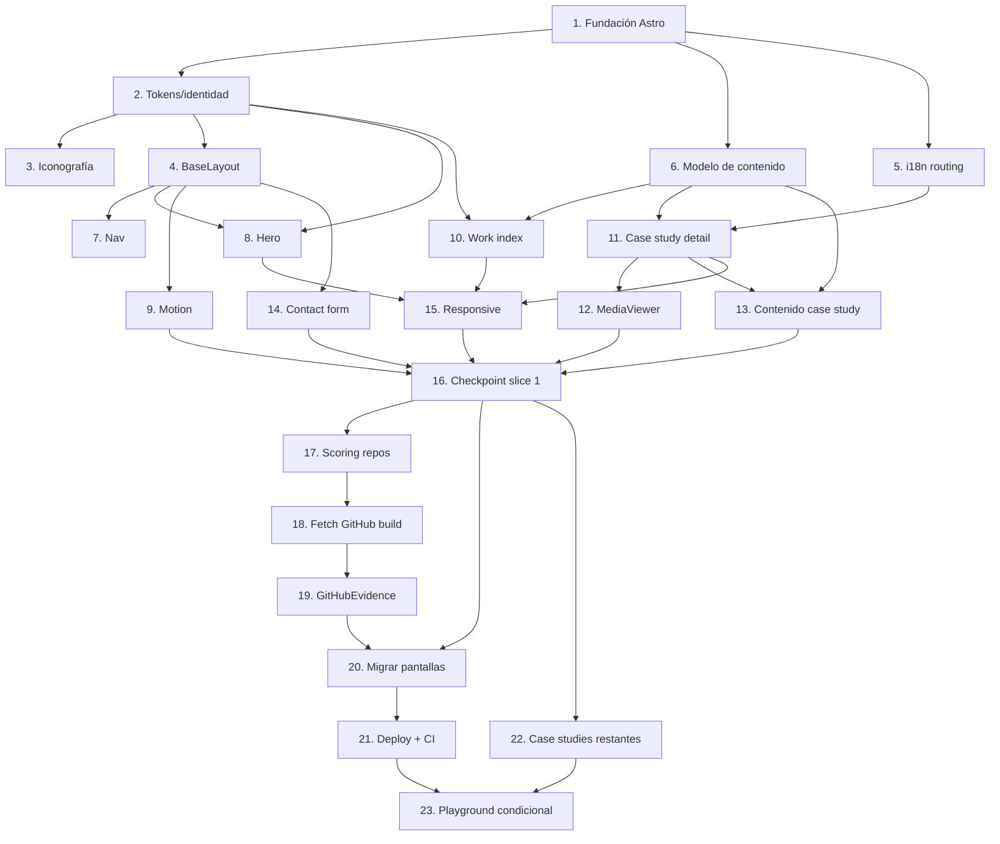

# Implementation Plan

## Overview

Estrategia: **strangler pattern**. Se levanta el proyecto Astro en paralelo y se entrega
primero el **slice vertical 1** (Req 11) con quality bar medible. Solo tras validarlo se porta
el resto. Cada tarea es incremental, deja el proyecto compilable y referencia los
requerimientos que satisface. Stack y deploy según ADR 0001/0002.

## Task Dependency Graph



```json
{
  "waves": [
    { "wave": 1, "tasks": [1] },
    { "wave": 2, "tasks": [2, 5, 6] },
    { "wave": 3, "tasks": [3, 4] },
    { "wave": 4, "tasks": [7, 8, 9, 10, 11] },
    { "wave": 5, "tasks": [12, 13, 14, 15] },
    { "wave": 6, "tasks": [16] },
    { "wave": 7, "tasks": [17, 20, 22] },
    { "wave": 8, "tasks": [18] },
    { "wave": 9, "tasks": [19] },
    { "wave": 10, "tasks": [21] },
    { "wave": 11, "tasks": [23] }
  ]
}
```

## Tasks

### Milestone 1 — Slice vertical (primer entregable)

- [x] 1. Inicializar la fundación Astro y el tooling
  - Crear proyecto Astro 7 (`output: 'static'`, TypeScript estricto), integrar MDX y `astro:assets`.
  - Configurar Vitest + fast-check y Playwright; añadir scripts npm (`dev`, `build`, `check`, `test`, `e2e`).
  - Configurar ESLint + type-check; dejar `astro build` pasando en vacío.
  - _Requirements: 1.1_

- [x] 2. Migrar el sistema de identidad visual a tokens y primitivos
  - Crear `styles/tokens.css` (color, escala tipográfica `--step-*`, espaciado 8pt, rejilla 12 col, radios, ease) desde `design.md` §4.5.
  - Self-hostear Space Grotesk / Inter / JetBrains Mono (subset latin, `font-display: swap`, ajuste métrico).
  - Crear primitivos `Section`, `Grid`, `Mono`, `Text` en `components/primitives/`.
  - _Requirements: 2.1, 2.3, 9.4_

- [x] 3. Crear el set de iconografía propio
  - Diseñar e implementar iconos SVG mínimos (flecha, enlace externo, repo, demo, idioma, menú) como componentes inline.
  - _Requirements: 2.2_

- [x] 4. Construir `BaseLayout` con head, SEO base, View Transitions y a11y
  - `<head>` con metadatos, theme-color, grain sutil, skip-link, `:focus-visible`.
  - Habilitar View Transitions de Astro con degradación elegante.
  - Inyectar JSON-LD `Person` y helpers de `lib/seo.ts`.
  - _Requirements: 4.2, 4.3, 8.3, 10.1_

- [x] 5. Implementar i18n routing real (`/es`, `/en`)
  - Configurar `astro:i18n`; crear `lib/i18n.ts` con diccionarios y `localizedPath`.
  - Escribir tests unit + property-based de `localizedPath` (idempotente, empieza con `/`).
  - _Requirements: 8.1, 8.2_

- [x] 6. Definir el modelo de contenido de case studies
  - Crear `content/config.ts` con el esquema Zod de `design.md` §8 (alt obligatorio, width/height, ≥1 decisión).
  - Validar que un MDX inválido rompe el build con mensaje claro.
  - _Requirements: 1.2, 1.3, 5.3, 6.1_

- [x] 7. Implementar la isla de navegación
  - `Nav.ts` (`client:idle`): scrollspy, menú móvil, switch de idioma; 100% teclado y foco visible.
  - _Requirements: 4.1, 4.4_

- [x] 8. Construir el Hero definitivo
  - Composición editorial asimétrica (identidad + declaración + prueba con destacados), HTML estático.
  - Reveal por máscara; sin glow, sin typing; respeta reduced-motion.
  - _Requirements: 3.1, 3.2, 3.3, 3.4_

- [x] 9. Implementar el sistema de animaciones (Motion + reduced-motion)
  - `Motion.ts` (`client:idle`) orquesta reveals; CSS scroll-driven cuando hay soporte, fallback IO.
  - Escribir property-based test: bajo reduced-motion / sin IntersectionObserver, todos los targets quedan visibles y no se observa nada.
  - _Requirements: 10.2, 10.3, 10.4_

- [ ] 10. Construir el índice de Work y `WorkCard`
  - `WorkIndex` lee la colección; `WorkCard` expone `transition:name` para el morph.
  - Filtro por categoría con estética integrada.
  - _Requirements: 5.1, 5.4_

- [ ] 11. Construir la página de detalle de case study
  - `CaseStudyLayout` (`/work/[slug]`): problema → rol → decisiones (con porqué) → desafíos → resultado → stack → medios → links.
  - JSON-LD `CreativeWork` localizado por proyecto.
  - _Requirements: 5.1, 5.2, 8.3_

- [ ] 12. Implementar el `MediaViewer` y el estándar de medios
  - Isla `MediaViewer.ts` (`client:visible`): carrusel/video accesible (teclado, swipe), lazy, `poster`, `preload="none"`.
  - Reservar espacio con width/height (CLS 0); decidir por proyecto reuse-vs-recompose (§2.5).
  - Property-based test de la propiedad CLS por contrato.
  - _Requirements: 6.1, 6.2, 6.3, 6.4_

- [ ] 13. Producir el contenido del primer case study real (end-to-end)
  - Elegir 1 proyecto destacado (p. ej. Chromora) y escribir el MDX completo en ES/EN con medios que pasen el estándar.
  - _Requirements: 5.2, 6.2, 11.1_

- [ ] 14. Implementar el formulario de contacto seguro
  - Isla `ContactForm.ts` (`client:visible`): `validateContact` pura (no vacío, longitudes, anti-spam), `aria-describedby` + `aria-live`.
  - En éxito, construir texto con `encodeURIComponent` y abrir `wa.me` con feedback; enlaces externos con `rel="noopener noreferrer"`.
  - Tests unit + property-based de `validateContact`.
  - _Requirements: 12.1, 12.2, 12.3, 12.4_

- [ ] 15. Responsive diseñado por breakpoint
  - Ajustar composición en 320 / 768 / 1024 / 1440 y ultra-wide (no solo adaptar): cada breakpoint intencional.
  - _Requirements: 2.5, 11.3_

- [ ] 16. Checkpoint de verificación del slice 1
  - Ejecutar Lighthouse (Perf/A11y/BP/SEO ≥ 95 mobile); verificar CWV (LCP ≤ 2.0s, INP ≤ 200ms, CLS ≤ 0.05) y JS inicial ≤ ~30 KB.
  - Verificar contraste AA con herramienta y navegación por teclado completa.
  - E2E del flujo Home→Work→Case study en verde.
  - _Requirements: 9.1, 9.2, 9.3, 9.5, 10.1, 11.2, 11.4, 11.5_

### Milestone 2 — GitHub como evidencia y deploy

- [ ] 17. Implementar el scoring y la selección de repos (funciones puras)
  - `lib/github.ts`: `score(repo)` y `select(repos, max)` según `design.md` §9.
  - Property-based tests: `|select| ≤ max`, sin forks/archivados/duplicados, score finito ≥ 0 y fork puntúa menos.
  - _Requirements: 7.3_

- [ ] 18. Crear el fetch de GitHub en build
  - `scripts/fetch-github.mjs`: pega a la API con `GH_TOKEN`, valida la forma (dato no confiable), escribe `content/data/github.json`.
  - Fallback a cache/dataset vacío válido si falla; no rompe el build.
  - _Requirements: 7.1, 7.2, 7.5, 12.5_

- [ ] 19. Construir el componente `GitHubEvidence`
  - Repos destacados + lenguajes predominantes + actividad relevante (sin métricas de vanidad), integrado en About.
  - _Requirements: 7.3, 7.4_

- [ ] 20. Migrar el resto de pantallas (About, Contact, sitemap)
  - About (absorbe Stack en contexto + GitHubEvidence + timeline depurado); Contact elevado; `sitemap.xml` con URLs por idioma y por proyecto.
  - _Requirements: 1.4, 1.5, 8.4_

- [ ] 21. Configurar deploy en Cloudflare Pages + CI
  - GitHub Actions: lint, type-check, tests, build, auditoría de presupuesto (Lighthouse CI/bundle) → publicar en Cloudflare Pages.
  - Preview deploy por PR; headers de caché inmutable para assets hasheados.
  - _Requirements: 13.1, 13.2, 13.3, 13.4_

- [ ] 22. Portar los case studies restantes
  - Escribir los MDX (ES/EN) de los proyectos destacados restantes con medios que pasen el estándar, siguiendo el estándar del slice 1.
  - _Requirements: 5.2, 6.2_

### Milestone 3 — Playground (condicional)

- [ ] 23. Evaluar y, si corresponde, construir el Playground
  - Reunir ≥ 3 piezas que cumplan el gate de calidad (§5.7), cada una con contexto y respetando performance/reduced-motion.
  - Si no se alcanzan 3 con el nivel requerido, NO publicar la sección.
  - _Requirements: 14.1, 14.2, 14.3_

## Notes

- **Checkpoints:** la tarea 16 es un gate duro; no se avanza al Milestone 2 sin pasar el quality bar (Req 11.5).
- **Tests:** funciones puras (`score`, `select`, `localizedPath`, `validateContact`) y propiedades de correctitud (`design.md` §Correctness Properties) se cubren con Vitest + fast-check.
- **Decisiones abiertas** (de `design.md` §16): contribuciones a terceros/privados, dominio propio vs `*.pages.dev`, orden de migración y modo claro — confirmar antes de las tareas afectadas (18, 20, 22).
- **Seguridad:** `GH_TOKEN` solo como secret de CI; tratar respuestas de GitHub como dato no confiable.
