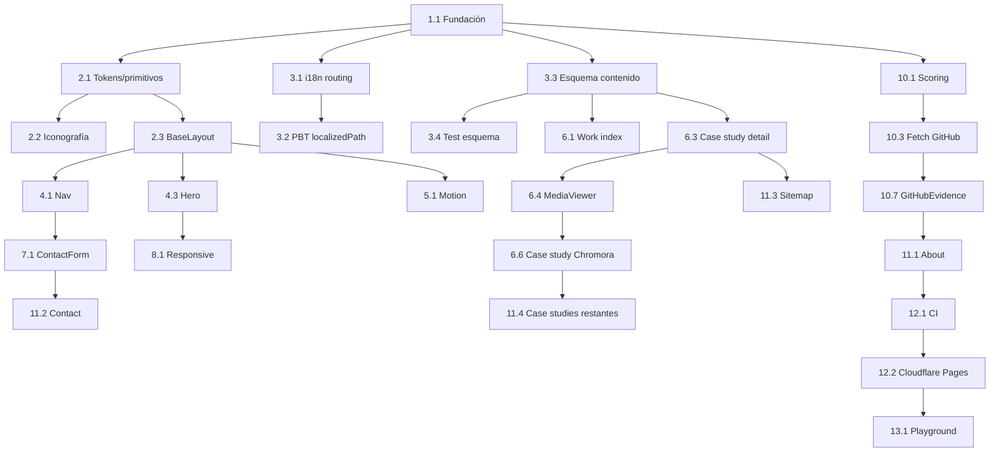

# Implementation Plan

## Overview

Estrategia: **strangler pattern**. Se levanta el proyecto Astro en paralelo y se entrega
primero el **slice vertical 1** (Req 11) con quality bar medible. Solo tras validarlo se porta
el resto. Cada tarea es incremental, deja el proyecto compilable y referencia los
requerimientos que satisface. Stack y deploy según ADR 0001/0002.

Implementación en **TypeScript + Astro** (islas vanilla TS, sin runtime de framework). Los
algoritmos de `design.md §9` (pseudocódigo) se implementan como funciones puras en `src/lib/`.
Las tareas de test marcadas con `*` son opcionales; las property-based derivan de la sección
**Correctness Properties** de `design.md` (Properties 1–8) y anotan la propiedad y la cláusula
de requerimiento que validan.

## Tasks

### Milestone 1 — Slice vertical (primer entregable)

- [x] 1. Fundación Astro y tooling
  - [x] 1.1 Inicializar la fundación Astro y el tooling
    - Crear proyecto Astro 7 (`output: 'static'`, TypeScript estricto), integrar MDX y `astro:assets`.
    - Configurar Vitest + fast-check y Playwright; scripts npm (`dev`, `build`, `check`, `test`, `e2e`).
    - Configurar ESLint + type-check; dejar `astro build` pasando en vacío.
    - _Requirements: 1.1_

- [x] 2. Sistema de identidad visual / design system
  - [x] 2.1 Migrar identidad visual a tokens y primitivos
    - Crear `styles/tokens.css` (color, escala tipográfica `--step-*`, espaciado 8pt, rejilla 12 col, radios, ease) desde `design.md §4.5`.
    - Self-hostear Space Grotesk / Inter / JetBrains Mono (subset latin, `font-display: swap`, ajuste métrico) en `styles/fonts.css`.
    - Crear primitivos `Section`, `Grid`, `Mono`, `Text` en `components/primitives/`.
    - _Requirements: 2.1, 2.3, 9.4_

  - [x] 2.2 Crear el set de iconografía propio
    - Iconos SVG mínimos (flecha, enlace externo, repo, demo, idioma, menú) como componentes inline.
    - _Requirements: 2.2_

  - [x] 2.3 Construir `BaseLayout` (head, SEO base, View Transitions, a11y)
    - `<head>` con metadatos, theme-color, grain sutil, skip-link, `:focus-visible`.
    - View Transitions de Astro con degradación elegante; JSON-LD `Person` y helpers de `lib/seo.ts`.
    - _Requirements: 4.2, 4.3, 8.3, 10.1_

  - [x] 2.4 Escribir unit tests de los helpers de SEO
    - Probar metadatos/JSON-LD localizados por página/idioma.
    - _Requirements: 8.3_

- [x] 3. i18n routing y modelo de contenido
  - [x] 3.1 Implementar i18n routing real (`/es`, `/en`)
    - Configurar `astro:i18n`; crear `lib/i18n.ts` con diccionarios y `localizedPath`.
    - _Requirements: 8.1, 8.2_

  - [x] 3.2 Escribir property test de `localizedPath`
    - **Property 4: i18n idempotente**
    - **Validates: Requirements 8.2**

  - [x] 3.3 Definir el modelo de contenido de case studies
    - `content.config.ts` / `content/schema.ts` con el esquema Zod de `design.md §8` (alt obligatorio, width/height, ≥1 decisión con rationale).
    - _Requirements: 1.2, 1.3, 5.3, 6.1_

  - [x] 3.4 Escribir test de validación del esquema de contenido
    - Verificar que un MDX inválido (sin `alt`, sin dimensiones, `decisions` vacío) rompe el build con mensaje claro.
    - _Requirements: 1.3_

- [x] 4. Navegación y Hero
  - [x] 4.1 Implementar la isla de navegación
    - `Nav` (`client:idle`) + `lib/nav.ts`: scrollspy, menú móvil, switch de idioma; 100% teclado y foco visible.
    - _Requirements: 4.1, 4.4_

  - [x] 4.2 Escribir unit tests de la lógica de navegación
    - Scrollspy y resolución de idioma; estados de menú.
    - _Requirements: 4.1_

  - [x] 4.3 Construir el Hero definitivo
    - Composición editorial asimétrica (identidad + declaración + prueba con destacados), HTML estático en `Hero.astro` + `lib/hero.ts`.
    - Reveal por máscara; sin glow, sin typing; respeta reduced-motion.
    - _Requirements: 3.1, 3.2, 3.3, 3.4_

  - [x] 4.4 Escribir unit tests de la composición del Hero
    - Selección de destacados y datos de identidad.
    - _Requirements: 3.1_

- [x] 5. Sistema de animaciones (Motion + reduced-motion)
  - [x] 5.1 Implementar el orquestador de animaciones
    - `Motion` (`client:idle`) + `lib/motion.ts`: reveals; CSS scroll-driven cuando hay soporte, fallback IntersectionObserver.
    - _Requirements: 10.2, 10.3, 10.4_

  - [x] 5.2 Escribir property test del reveal seguro
    - **Property 6: Reveal seguro** (bajo reduced-motion / sin IntersectionObserver, todos los targets quedan visibles y no se observa nada).
    - **Validates: Requirements 10.3**

  - [x] 5.3 Escribir property test de no pérdida de contenido
    - **Property 7: Sin pérdida de contenido** (ningún camino de animación deja un elemento invisible o inaccesible por teclado).
    - **Validates: Requirements 10.4**

- [x] 6. Work index y case study
  - [x] 6.1 Construir el índice de Work y `WorkCard`
    - `WorkIndex` lee la colección; `WorkCard` expone `transition:name` para el morph; filtro por categoría con estética integrada. Apoyo en `lib/work.ts`.
    - _Requirements: 5.1, 5.4_

  - [x] 6.2 Escribir unit tests de la lógica de Work
    - Orden, filtrado por categoría y selección de destacados.
    - _Requirements: 5.4_

  - [x] 6.3 Construir la página de detalle de case study
    - `CaseStudyLayout` + `/[lang]/work/[slug]`: problema → rol → decisiones (con porqué) → desafíos → resultado → stack → medios → links; JSON-LD `CreativeWork` localizado.
    - _Requirements: 5.1, 5.2, 8.3_

  - [x] 6.4 Implementar el `MediaViewer` y el estándar de medios
    - `MediaViewer` (`client:visible`) + `lib/media.ts`: carrusel/video accesible (teclado, swipe), lazy, `poster`, `preload="none"`; reservar espacio con width/height (CLS 0).
    - _Requirements: 6.1, 6.2, 6.3, 6.4_

  - [x] 6.5 Escribir property test de CLS por contrato
    - **Property 8: CLS por contrato** (todo `MediaAsset` con width/height ⟹ layout reserva espacio).
    - **Validates: Requirements 6.4**

  - [x] 6.6 Producir el primer case study real end-to-end (Chromora)
    - MDX completo en ES/EN con medios que pasen el estándar (§2.5).
    - _Requirements: 5.2, 6.2, 11.1_

- [x] 7. Formulario de contacto seguro
  - [x] 7.1 Implementar el formulario de contacto
    - `ContactForm` (`client:visible`) + `lib/contact.ts`: `validateContact` pura (no vacío, longitudes, anti-spam), `aria-describedby` + `aria-live`.
    - En éxito, construir texto con `encodeURIComponent` y abrir `wa.me`; enlaces externos con `rel="noopener noreferrer"`.
    - _Requirements: 12.1, 12.2, 12.3, 12.4_

  - [x] 7.2 Escribir property test de `validateContact`
    - **Property 5: Validación pura** (sin efectos; `ok ⟺` reglas de nombre/mensaje/longitud/anti-spam).
    - **Validates: Requirements 12.1**

- [x] 8. Responsive diseñado por breakpoint
  - [x] 8.1 Ajustar composición por breakpoint
    - 320 / 768 / 1024 / 1440 y ultra-wide: cada breakpoint intencional (no solo adaptar).
    - _Requirements: 2.5, 11.3_

- [x] 9. Checkpoint de verificación del slice 1
  - [x] 9.1 Verificar el quality bar del slice 1
    - Lighthouse (Perf/A11y/BP/SEO ≥ 95 mobile); CWV (LCP ≤ 2.0s, INP ≤ 200ms, CLS ≤ 0.05) y JS inicial ≤ ~30 KB.
    - Contraste AA, navegación por teclado completa y E2E Home→Work→Case study en verde.
    - Ensure all tests pass, ask the user if questions arise.
    - _Requirements: 9.1, 9.2, 9.3, 9.5, 10.1, 11.2, 11.4, 11.5_

### Milestone 2 — GitHub como evidencia y deploy

- [x] 10. GitHub como evidencia curada (build-time)
  - [x] 10.1 Implementar scoring y selección de repos (funciones puras)
    - `lib/github.ts`: `score(repo)` y `select(repos, max)` según `design.md §9`.
    - _Requirements: 7.3_

  - [x] 10.2 Escribir property tests de scoring y selección
    - **Property 1: Cota de curaduría** (`|select| ≤ max`).
    - **Property 2: Pureza de la selección** (sin forks/archivados/duplicados, orden por score desc).
    - **Property 3: Score bien formado** (finito, ≥ 0, fork puntúa menos que su equivalente).
    - **Validates: Requirements 7.3**

  - [x] 10.3 Crear el fetch de GitHub en build
    - `src/scripts/fetch-github.mjs`: pega a la API con `GH_TOKEN`, valida la forma (dato no confiable), escribe `content/data/github.json`.
    - Fallback a cache/dataset vacío válido si falla; no rompe el build.
    - _Requirements: 7.1, 7.2, 7.5, 12.5_

  - [x] 10.4 Escribir tests del fetch/validación de GitHub
    - Validación de forma de datos malformados y fallback sin romper el build.
    - _Requirements: 7.5, 12.5_

  - [x] 10.5 Modelar colaboraciones/contribuciones a terceros (curado a mano)
    - `content/data/collaborations.ts`: fuente tipada y curada (sin métricas de vanidad), con `LocalizedText` y flag `published`/`private` (resuelve decisión abierta A de `design.md §16`).
    - _Requirements: 7.1, 7.4_

  - [x] 10.6 Escribir tests del modelo de colaboraciones
    - Filtrado por `published`, manejo de entradas privadas sin enlace muerto.
    - _Requirements: 7.4_

  - [x] 10.7 Construir el componente `GitHubEvidence`
    - Repos destacados + lenguajes predominantes + actividad relevante + colaboraciones (sin métricas de vanidad), listo para integrarse en About.
    - _Requirements: 7.3, 7.4_

- [x] 11. Migrar el resto de pantallas
  - [x] 11.1 Construir la página About
    - About absorbe Stack en contexto + `GitHubEvidence` + timeline depurado, en `/[lang]/about`.
    - _Requirements: 1.4, 1.5_

  - [x] 11.2 Construir la página Contact elevada
    - Página `/[lang]/contact` con CTA final fuerte e isla `ContactForm` integrada.
    - _Requirements: 1.4_

  - [x] 11.3 Generar el sitemap por idioma y por proyecto
    - `sitemap.xml` con URLs por idioma (`/es`, `/en`) y por case study.
    - _Requirements: 8.4_

  - [x] 11.4 Portar los case studies destacados restantes
    - Escribir los MDX (ES/EN) restantes siguiendo el estándar del slice 1 (Chromora y Prode ya hechos).
    - _Requirements: 5.2, 6.2_

- [x] 12. Deploy en Cloudflare Pages + CI
  - [x] 12.1 Configurar el pipeline de CI
    - GitHub Actions: lint, type-check, tests (unit + property-based), build y auditoría de presupuesto (Lighthouse CI/bundle) antes de publicar.
    - _Requirements: 13.1, 13.3_

  - [x] 12.2 Publicar en Cloudflare Pages con previews y caché
    - Publicar desde Actions; preview deploy por PR; headers de caché inmutable para assets hasheados.
    - _Requirements: 13.1, 13.2, 13.4_

### Milestone 3 — Playground (condicional)

- [x] 13. Playground (condicional)
  - [x] 13.1 Evaluar y, si corresponde, construir el Playground
    - Reunir ≥ 3 piezas que cumplan el gate de calidad (§5.7), cada una con contexto y respetando performance/reduced-motion.
    - Si no se alcanzan 3 con el nivel requerido, NO publicar la sección.
    - _Requirements: 14.1, 14.2, 14.3_

## Notes

- **Estado actual:** Milestone 1 completo (fundación, identidad, i18n, contenido, Hero, Nav, Motion, Work, case study, MediaViewer, contacto, responsive y checkpoint). En Milestone 2 ya están las funciones puras de scoring, el fetch de build y el modelo de colaboraciones con sus tests; resta `GitHubEvidence` (10.7), la migración de About/Contact/sitemap (11) y el deploy/CI (12).
- **Checkpoints:** la tarea 9.1 es un gate duro; no se avanza al Milestone 2 sin pasar el quality bar (Req 11.5).
- **Tareas opcionales (`*`):** unit/property/integration tests. Las property-based (`fast-check`) cubren las Properties 1–8 de `design.md §Correctness Properties`. Las funciones puras testeadas son `score`, `select`, `localizedPath`, `validateContact` y el reveal de Motion.
- **Decisiones abiertas** (de `design.md §16`): A (contribuciones a terceros/privados) resuelta vía `collaborations.ts` curado; B (dominio propio vs `*.pages.dev`) confirmar antes de 12.2; C (orden de migración) afecta 11.4; D (modo claro) fuera del alcance del slice 1.
- **Seguridad:** `GH_TOKEN` solo como secret de CI; tratar respuestas de GitHub como dato no confiable (validación de forma en `fetch-github.mjs`).

## Task Dependency Graph



```json
{
  "waves": [
    { "id": 0, "tasks": ["1.1"] },
    { "id": 1, "tasks": ["2.1", "3.1", "3.3"] },
    { "id": 2, "tasks": ["2.2", "2.3", "3.2", "3.4"] },
    { "id": 3, "tasks": ["4.1", "4.3", "5.1", "6.1", "6.3", "10.1"] },
    { "id": 4, "tasks": ["2.4", "4.2", "4.4", "5.2", "5.3", "6.2", "6.4", "7.1", "10.2", "10.3", "10.5"] },
    { "id": 5, "tasks": ["6.5", "6.6", "7.2", "8.1", "10.4", "10.6"] },
    { "id": 6, "tasks": ["10.7", "11.4"] },
    { "id": 7, "tasks": ["11.1", "11.2", "11.3"] },
    { "id": 8, "tasks": ["12.1"] },
    { "id": 9, "tasks": ["12.2"] },
    { "id": 10, "tasks": ["13.1"] }
  ]
}
```
